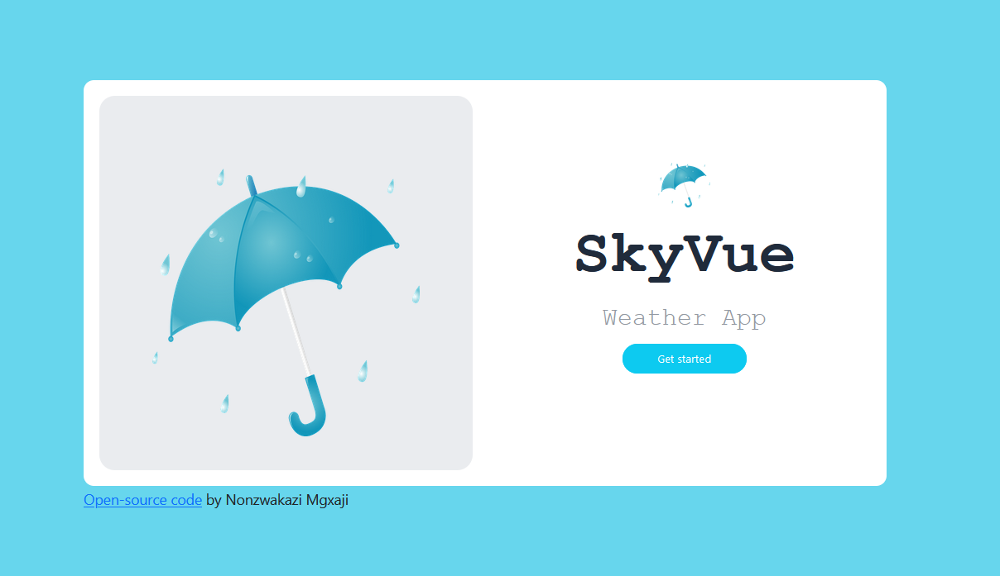
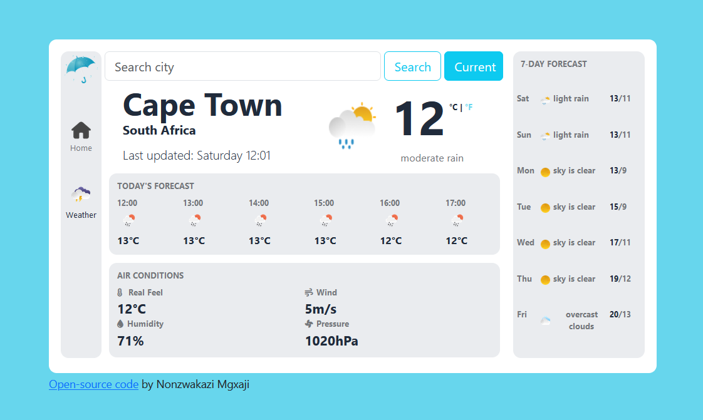

# WEATHER APP

## Overview

This project is a weather app that allows users to search for weather information of any city and retrieve weather data for their current location.
It is built using HTML, CSS and JavaScript, and utilizes a two weather APIs(OpenWeatherMap API and the SheCodes Weather API) to fetch and display data.
This weather app is available on Netlify and can be accessed via the link below:

[SkyVue Weather App](https://main--skyvue-weather-app.netlify.app/)

## Features

- Search for weather information of any city:
  - Users can enter the name of a city in the search bar and retrieve the current weather conditions, inluding temeperature, weather description, wind speed, humidity, and pressure.
- Current location weather:
  - Users can retrieve weather conditions for their current location by clicking the current button. The app will access the user's geolocation data(with their permission) and provide the weather information accordingly.
- Unit change:
  - Users have the option to display the temperature in Celcius or Fahrenheit and can change it as they please by clicking on either °C or °F.

## Future features

- The project is still a work in progress
- A settings feature to set the imperial and metric units for the different weather conditions.
- For the hourly forecast to display the hour and temperature of every 3 hours (Example: 15:00, 18:00, 21:00. etc)
- A responsive design for the app to work well on different devices and screen sizes, to ensure a consistent user experience across desktop and mobile devices.

## Installation

To run the Weather App locally, follow the steps below:

1. Clone the repository or download the project files to your local machine.
2. Open the project folder and locate the `index.html` file.
3. Double-click on `index.html` to open it in your preferred web browser.

## Usage

1. Upon opening the Weather App in your web browser, you will see a search bar at the top of the page.
2. To search for weather information of a specific city, type the city name in the search bar and press Enter or click the search button.
3. The app will display the current weather conditions for the searched city, including temperature, humidity, wind speed, pressure and weather description.
4. To retrieve weather data for your current location, click on the "Current" button. You will be prompted to allow the app to access your geolocation data.
5. After granting permission, the app will fetch the weather information for your current location and display it on the screen.
6. To search for weather data of another city or retrieve weather for a different location, repeat steps 2-5.

## Configuration

The Weather App utilizes a weather API to fetch weather data. The API used can be configured in the JavaScript code to support different weather providers or APIs. To configure the API, follow these steps:

1. Open the project folder and locate the app.js file within the src directory.
2. In the app.js file, find the variable named apiKey.
3. Replace the value of apiKey with your own API key for the desired weather API provider. If you don't have an API key, you can obtain one by signing up with a weather data provider and following their documentation.
4. Save the changes to the app.js file.

## Dependencies

The Weather App does not require any external dependencies or libraries. Bootstrap was used to a certain degree however it can be built using plain HTML, CSS, and JavaScript.

## Key Topics

The following technologies used in this project:

- HTML
- CSS
- JavaScript
- API
- VScode
- GitHub
- Bootstrap
- Hosting(Netlify)

## Helpful Links

- [HTML MDN](https://developer.mozilla.org/en-US/docs/Web/HTML)
- [CSS MDN](https://developer.mozilla.org/en-US/docs/Web/CSS)
- [JavaScript MDN](https://developer.mozilla.org/en-US/docs/Web/JavaScript)
- [Bootstrap](https://getbootstrap.com/docs/5.3/getting-started/introduction/)
- [APIs](https://developer.mozilla.org/en-US/docs/Learn/JavaScript/Client-side_web_APIs/Introduction)
- [AJAX](https://developer.mozilla.org/en-US/docs/Web/Guide/AJAX)
- [Get Axios](https://github.com/axios/axios)
- [OpenWeather API Documentation](https://openweathermap.org/current)
- [Geolocation API](https://developer.mozilla.org/en-US/docs/Web/API/Geolocation_API)

## Contributing

Contributions to the Weather App are welcome! If you find any issues, have suggestions for improvement, or would like to add new features, please submit an issue or a pull request to the project's repository on GitHub.

Looking forward to some feedback and constructive criticism in my learning journey.

When contributing, please adhere to the following guidelines:

- Fork the repository and create your branch from the main branch.
- Clone your forked repository
- Make your changes and test thoroughly.
- Ensure your code follows the project's coding style and conventions.
- Provide clear commit messages and comments for your changes and push.
- Create a pull request, describing the changes you made and their purpose.
- Wait for pull request to merge

## Acknowledgements

The Weather App utilizes weather data provided by external APIs, and proper attribution is given within the application to comply with the terms of service of the respective weather API providers.

We would like to express our gratitude to the developers and maintainers of the weather API providers for providing the data used in this application.

Another huge shout out to Matt Delac(@matthieua) and the SheCodes programme and their online coding workshops for women. If you would like to gain some coding skills, do check them out on the link below:

[SheCodes](https://www.shecodes.io/)

## Contact

If you have any questions, suggestions, or feedback regarding the Weather App, or would like to connect, please feel free to contact me on [LinkedIn](https://www.linkedin.com/in/nonzwakazimgxaji/) or via email at nonzwakazimgxaji@outlook.com

## Complete weather app look

